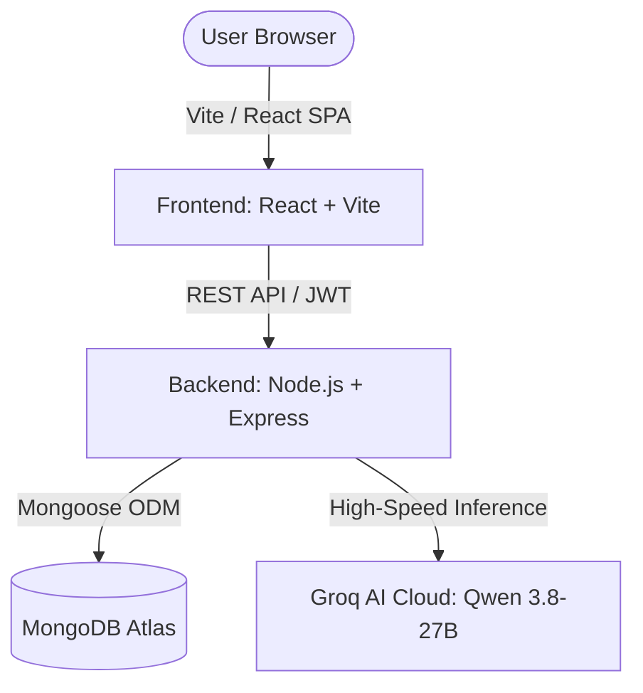

# SAARTHIX AI — Next-Gen AI Career & Placement Intelligence Platform

[](https://react.dev/)
[](https://nodejs.org/)
[](https://www.mongodb.com/)
[](https://groq.com/)
[](https://opensource.org/licenses/MIT)

**SAARTHIX AI** is an intelligent, multi-role career preparation and placement readiness platform engineered for Computer Science, IT students, and tech professionals. It dynamically adapts its entire intelligence engine across **30+ specialized job roles** (from Full Stack Developer and Cloud Engineer to Data Scientist and Cybersecurity Analyst).

---

## 🌟 Flagship Features

### 1. 🎙️ AI Mock Interview Simulator
* **Dynamic Role Adaptation**: Choose from 30+ tech job roles and 3 experience levels (Entry, Mid, Senior).
* **3 Interview Modes**:
  * ⚡ **Technical & Architecture**: Deep dive into framework internals, memory management, databases, and language mechanics.
  * 🏗️ **System Design & Scalability**: Distributed architecture, caching, microservices, and database indexing.
  * 🤝 **Behavioral & STAR**: Real-world engineering scenarios, deadline management, and technical conflict resolution.
* **Instant 1–10 AI Evaluation**: Provides objective numerical scoring, highlighted strengths, and identified missing concepts.
* **🏆 Master-Class Senior Model Answers**: View optimal, senior-level model responses for every single question.
* **Executive Hiring Scorecard**: Comprehensive final hiring verdict (*Strong Hire*, *Hire*, *Leaning Hire*, *Needs Practice*), strengths matrix, and critical areas to revise before real interviews.

### 2. 🎯 Real-Time Job Description (JD) Matcher
* Paste any job posting from **LinkedIn, Indeed, or career portals**.
* **ATS Fit Percentage**: Computes an accurate semantic and keyword match score (0–100%).
* **Side-by-Side Keyword Analysis**:
  * ✅ **Matching Keywords** detected in your resume.
  * ⚠️ **Missing / Underrepresented Requirements** needed to pass ATS screens.
* **Tailored Optimization Tips**: Generates 3–4 specific, actionable resume modifications to maximize interview callbacks.

### 3. ✍️ Google XYZ-Formula Resume Bullet Rewriter
* Turns ordinary, duty-focused resume bullet points into high-impact, metric-driven statements.
* Follows the Google formula: *"Accomplished [X] as measured by [Y], by doing [Z]"*.
* Generates 3 distinct variations:
  * ⚡ **Metric & Performance Impact** (quantified latency reduction, scale, %).
  * 🏗️ **Technical Architecture & Depth** (system design, concurrency, indexing).
  * 🤝 **Ownership & Delivery** (cross-functional delivery, zero regressions).
* **1-Click Copy**: Instant clipboard copy button for rapid resume editing.

### 4. 📄 Multi-Role Resume Analyzer & ATS Scorer
* Client-side PDF text extraction powered by `pdfjs-dist`.
* Domain-specific ATS scoring comparing candidate skills against 30+ tech role benchmarks.
* Section-by-section breakdown (Education, Experience, Skills, Projects, Certifications).

### 5. 🗺️ Role-Adaptive Career Roadmap
* Personalized learning pathways divided into prioritized phases.
* Direct official documentation links for languages, frameworks, databases, and DevOps tools.
* Interactive progress tracking saved per user profile.

### 6. 🤖 24/7 SAARTHIX AI Mentor
* Powered by Groq's high-speed active LLM (`qwen/qwen3.8-27b`).
* Context-aware conversational mentor loaded with domain benchmarks, portfolio project recommendations, and technical interview guidance.

---

## 🛠️ Architecture & Tech Stack



* **Frontend**: React 19, Vite, PDF.js (`pdfjs-dist`), Modern High-Contrast CSS.
* **Backend**: Node.js, Express.js, JWT Authentication, CORS.
* **Database**: MongoDB Atlas via Mongoose.
* **AI Engine**: Groq SDK with `qwen/qwen3.8-27b` for sub-second structured JSON completions.

---

## 🚀 Local Development Setup

### 1. Clone the repository
```bash
git clone https://github.com/<your-username>/saarthix-ai.git
cd saarthix-ai
```

### 2. Backend Setup
```bash
cd server
npm install
```
Create a `.env` file in `server/` (see `server/.env.example`):
```env
PORT=5000
CLIENT_URL=http://localhost:5173
MONGO_URI=your_mongodb_connection_string
JWT_SECRET=your_jwt_secret_key
GROQ_API_KEY=your_groq_api_key
GROQ_MODEL=qwen/qwen3.8-27b
```
Start backend server:
```bash
npm start
# or with nodemon:
npm run dev
```

### 3. Frontend Setup
In a new terminal:
```bash
cd client
npm install
npm run dev
```
Open [http://localhost:5173](http://localhost:5173) in your browser.

---

## ☁️ Cloud Deployment Guide

### Option A: Backend on Render (Free)
1. Go to [Render.com](https://render.com) and create a **New Web Service**.
2. Connect your GitHub repository.
3. Set the following:
   * **Root Directory**: `server`
   * **Build Command**: `npm install`
   * **Start Command**: `node server.js`
4. In **Environment Variables**, add:
   * `MONGO_URI`: Your MongoDB connection string.
   * `JWT_SECRET`: A secure random string.
   * `GROQ_API_KEY`: Your Groq API key.
   * `CLIENT_URL`: Your deployed frontend URL (e.g. `https://saarthix-ai.vercel.app`).
5. Click **Deploy**. Note your backend URL (e.g. `https://saarthix-api.onrender.com`).

---

### Option B: Frontend on Vercel (Free)
1. Go to [Vercel.com](https://vercel.com) and click **Add New Project**.
2. Import your GitHub repository.
3. Configure project settings:
   * **Root Directory**: `client`
   * **Framework Preset**: `Vite`
   * **Build Command**: `npm run build`
   * **Output Directory**: `dist`
4. In **Environment Variables**, add:
   * `VITE_API_URL`: Your deployed backend URL (e.g. `https://saarthix-api.onrender.com`).
5. Click **Deploy**.

---

## 🛡️ Security Best Practices
* Sensitive API keys (`GROQ_API_KEY`, `MONGO_URI`, `JWT_SECRET`) are never committed to version control.
* `.gitignore` excludes all `.env` files, build directories, and node_modules.
* Passwords are securely hashed with `bcryptjs` before database storage.
* Authenticated endpoints require valid JWT Bearer tokens with strict user validation.

---

## 📄 License
This project is licensed under the MIT License — see the [LICENSE](LICENSE) file for details.
