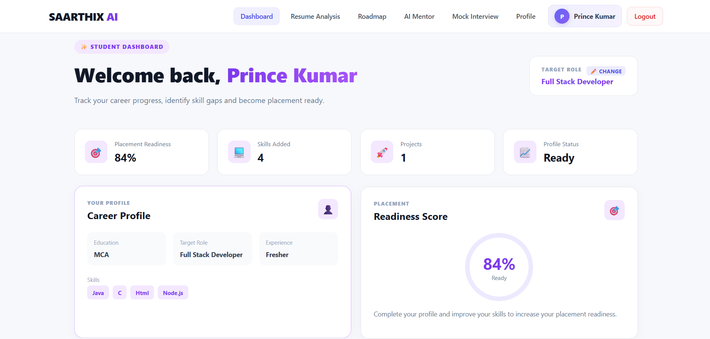
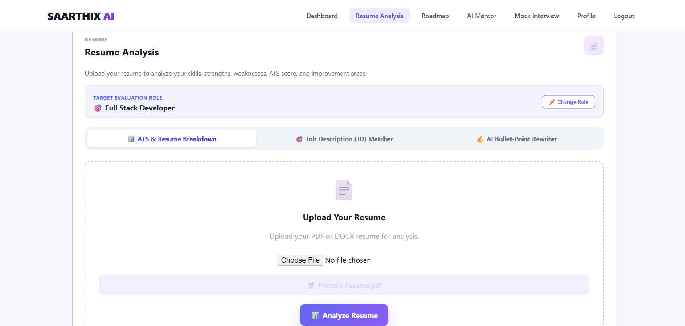
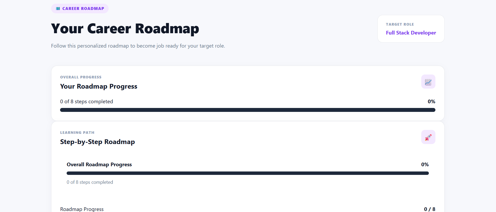
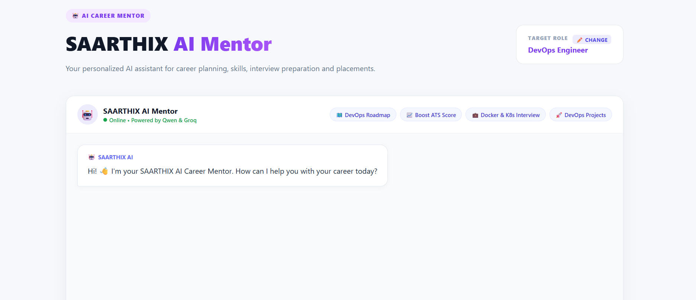
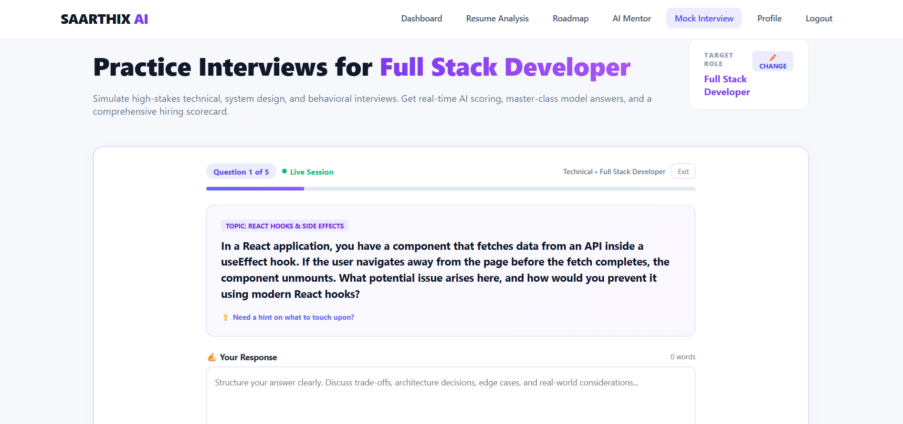

<div align="center">

# 🚀 SAARTHIX AI

### AI-Powered Career & Placement Intelligence Platform

**Prepare smarter. Practice better. Build your career with AI.**

SAARTHIX AI combines AI-powered interviews, resume analysis, job matching, career roadmaps and an intelligent AI mentor into one modern career preparation platform.

<a href="https://github.com/MrPrince82/SAARTHIX-AI">

</a>

<a href="https://saarthix-ai-backend.onrender.com">

</a>

<a href="https://vercel.com/">

</a>


</div>

---

## 🧠 What is SAARTHIX AI?

**SAARTHIX AI** is an AI-powered career preparation and placement-readiness platform designed for Computer Science students, IT students, developers, and technology professionals.

It brings multiple career tools together into a single platform:

> 🎙️ Practice Interviews → 📄 Improve Resume → 🎯 Match Jobs → 🗺️ Follow Roadmaps → 🤖 Learn with AI

The platform adapts its guidance according to the user's **target technology role**, skills, and experience level.

SAARTHIX AI supports **30+ specialized technology roles**, including Full Stack Development, Data Analytics, Data Science, Cloud Engineering, DevOps, Cybersecurity, and more.

---

# ✨ Core Features

| 🎙️ AI Interviews | 📄 Resume Analyzer | 🎯 JD Matcher |
|:---:|:---:|:---:|
| Practice realistic AI-powered interviews | Analyze resume & ATS compatibility | Compare resume with job descriptions |

| ✍️ Resume Rewriter | 🗺️ Career Roadmap | 🤖 AI Mentor |
|:---:|:---:|:---:|
| Improve resume bullet points | Build role-specific learning paths | Get technical & career guidance |

---

# 🎙️ AI Mock Interview Simulator

Practice realistic interviews based on your:

- 🎯 Target role
- 📈 Experience level
- 💻 Technical skills
- 🏗️ System design knowledge
- 🤝 Behavioral preparation

### Interview Flow

```text
        Select Target Role
               ↓
       Select Experience
               ↓
       Choose Interview Type
               ↓
      AI Generated Questions
               ↓
       Submit Your Answers
               ↓
          AI Evaluation
               ↓
     Strengths & Weaknesses
               ↓
       Improvement Areas
               ↓
       Interview Scorecard
```

---

# 📄 Resume Analyzer & ATS Scorer

Analyze your resume and understand its compatibility with your target technology role.

### Key Capabilities

- 📑 Resume PDF analysis
- 🔍 Skill identification
- 🎯 Role-specific analysis
- 📊 ATS-oriented scoring
- 🧩 Section-wise resume insights
- 💡 Improvement suggestions

### Resume Analysis Flow

```text
        Upload Resume
             ↓
     Extract Resume Content
             ↓
       Analyze Skills
             ↓
     Select Target Role
             ↓
      ATS Analysis
             ↓
   Strengths & Weaknesses
             ↓
     Improvement Areas
```

---

# 🎯 Job Description Matcher

Compare your resume and skills with a job description.

### Features

- 🔎 Matching keywords
- ⚠️ Missing requirements
- 📊 ATS compatibility
- 🧠 Job requirement analysis
- 💡 Resume optimization suggestions

### Workflow

```text
       Paste Job Description
                ↓
       Analyze Requirements
                ↓
        Analyze Resume
                ↓
       Compare Skills
                ↓
   Matching + Missing Skills
                ↓
      Optimization Tips
```

---

# ✍️ Resume Bullet Rewriter

Improve ordinary resume bullet points using an AI-powered rewriting workflow.

### Features

- ⚡ Impact-focused rewriting
- 📈 Metric-oriented statements
- 🏗️ Technical depth
- 🤝 Ownership-focused variations
- 📋 One-click copy

---

# 🗺️ Career Roadmap

Build a role-specific learning path according to your career target.

### Includes

- 🎯 Role-based learning
- 📚 Skill progression
- 🧩 Learning phases
- 🔗 Official documentation/resources
- 📈 Progress tracking

### Roadmap Flow

```text
       Select Target Role
               ↓
       Core Fundamentals
               ↓
        Required Skills
               ↓
       Tools & Frameworks
               ↓
            Projects
               ↓
       Interview Preparation
```

---

# 🤖 SAARTHIX AI Mentor

Get AI-powered technical and career guidance through an intelligent mentor.

### Mentor Capabilities

- 💻 Technical guidance
- 🎯 Career preparation
- 🧠 Interview preparation
- 🏗️ Project guidance
- 📚 Learning guidance
- 🛠️ Technology guidance

---
## 📸 Project Screenshots

### 🏠 Landing Page


### 📊 Dashboard


### 📄 Resume Analysis


### 🎯 Job Description Matcher


### 🗺️ Career Roadmap


### 🤖 AI Career Mentor


### 🎙️ Mock Interview


# 🛠️ Technology Stack

### Frontend

- React
- Vite
- JavaScript
- CSS
- PDF.js

### Backend

- Node.js
- Express.js
- JWT Authentication
- REST APIs
- CORS

### Database

- MongoDB Atlas
- Mongoose

### AI

- Groq API
- AI-powered career and interview workflows

### Deployment

- Render
- Vercel
- MongoDB Atlas

---

# 🏗️ System Architecture

```text
                    ┌─────────────────┐
                    │      User       │
                    │    Browser      │
                    └────────┬────────┘
                             │
                             ▼
                    ┌─────────────────┐
                    │ React + Vite    │
                    │    Frontend     │
                    └────────┬────────┘
                             │
                        REST API
                             │
                             ▼
                    ┌─────────────────┐
                    │ Node.js +       │
                    │ Express Backend │
                    └──────┬─────┬────┘
                           │     │
                  ┌────────┘     └────────┐
                  ▼                       ▼
          ┌──────────────┐        ┌──────────────┐
          │ MongoDB      │        │   Groq AI    │
          │    Atlas     │        │     API      │
          └──────────────┘        └──────────────┘
```

---

# 📂 Project Structure

```text
SAARTHIX-AI/
│
├── client/
│   ├── public/
│   ├── src/
│   ├── package.json
│   └── ...
│
├── server/
│   ├── routes/
│   ├── models/
│   ├── middleware/
│   ├── server.js
│   ├── package.json
│   └── ...
│
├── render.yaml
├── LICENSE
├── README.md
└── .gitignore
```

---

# 🚀 Installation

## 1. Clone Repository

```bash
git clone https://github.com/MrPrince82/SAARTHIX-AI.git
cd SAARTHIX-AI
```

---

## 2. Backend Setup

```bash
cd server
npm install
```

Create a `.env` file inside the `server` directory:

```env
PORT=5000
MONGO_URI=your_mongodb_connection_string
JWT_SECRET=your_jwt_secret
GROQ_API_KEY=your_groq_api_key
CLIENT_URL=http://localhost:5173
```

Start the backend:

```bash
npm start
```

---

## 3. Frontend Setup

Open a new terminal:

```bash
cd client
npm install
npm run dev
```

Open:

```text
http://localhost:5173
```

---

# ☁️ Deployment

## Backend — Render

The SAARTHIX AI backend is deployed as a Render Web Service.

### Render Configuration

```text
Root Directory: server
Build Command: npm install
Start Command: npm start
```

### Required Environment Variables

```env
MONGO_URI=your_mongodb_connection_string
JWT_SECRET=your_jwt_secret
GROQ_API_KEY=your_groq_api_key
CLIENT_URL=your_frontend_url
```

### Live Backend

https://saarthix-ai-backend.onrender.com

---

## Frontend — Render

The frontend can be deployed as a Render Static Site.

```text
Root Directory: client
Build Command: npm install && npm run build
Publish Directory: dist
```

Set:

```env
VITE_API_URL=https://saarthix-ai-backend.onrender.com
```

### Live Frontend

https://saarthix-ai-frontend.onrender.com

---

## Frontend — Vercel

The frontend can also be deployed using Vercel.

```text
Root Directory: client
Framework: Vite
Build Command: npm run build
Output Directory: dist
```

Environment variable:

```env
VITE_API_URL=https://saarthix-ai-backend.onrender.com
```

---

# 🔐 Security

- Environment variables are used for sensitive credentials.
- API keys should never be committed to GitHub.
- MongoDB credentials should remain private.
- JWT secrets should remain private.
- `.env` files should remain excluded through `.gitignore`.
- Authentication is handled through JWT-based authorization.

---

# 🧪 Build

Build the frontend:

```bash
cd client
npm run build
```

Build output:

```text
client/dist
```

Install and start the backend:

```bash
cd server
npm install
npm start
```

---

# 🔮 Future Enhancements

- 🎤 Voice-based mock interviews
- 📊 Advanced career analytics
- 🧠 More AI-powered learning features
- 📱 Mobile application
- 🔔 Personalized career notifications
- 📈 Advanced progress dashboards
- 🎓 Placement preparation modules

---

# 👨‍💻 Author

### Prince Kumar

**SAARTHIX AI — AI-Powered Career & Placement Intelligence Platform**

GitHub:

https://github.com/MrPrince82

Project:

https://github.com/MrPrince82/SAARTHIX-AI

---

# ⭐ Support

If you find **SAARTHIX AI** useful:

⭐ Star the repository  
🍴 Fork the project  
🐛 Report issues  
💡 Suggest improvements  

---

# 📜 License

This project is licensed under the **MIT License**.

See the [LICENSE](LICENSE) file for details.

---

<div align="center">

### 🚀 SAARTHIX AI

**Prepare smarter. Practice better. Build your career with AI.**

</div>
